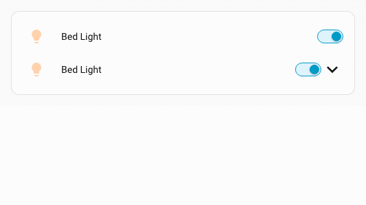
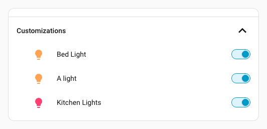
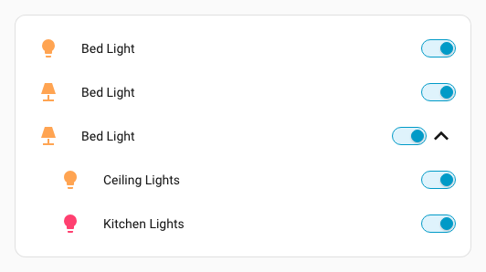
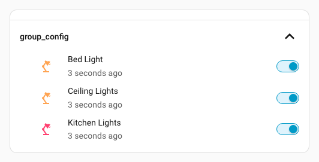
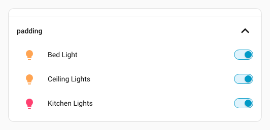
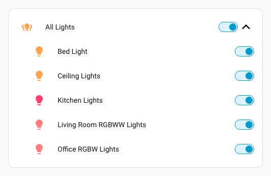
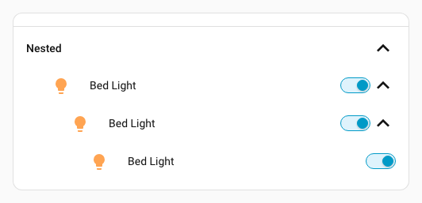
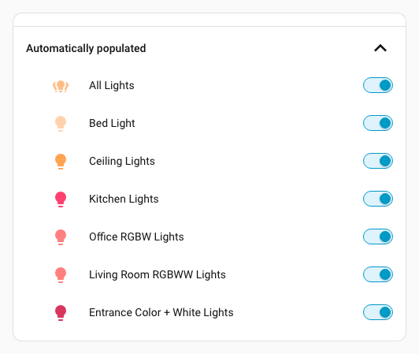
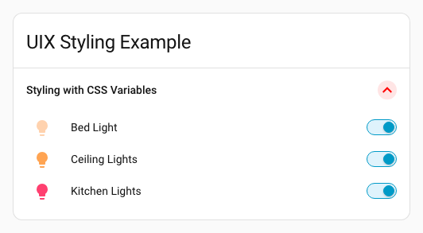

# fold-entity-row

Forked from [thomasloven/lovelace-fold-entity-row](https://github.com/thomasloven/lovelace-fold-entity-row) to continue development of this project.

Fold away and hide rows in lovelace [entities](https://www.home-assistant.io/lovelace/entities/) cards.

## Installing

[](https://my.home-assistant.io/redirect/hacs_repository/?owner=Lint-Free-Technology&repository=lovelace-fold-entity-row&category=plugin)

To install via HACS, add this repo [https://github.com/Lint-Free-Technology/lovelace-fold-entity-row](https://github.com/Lint-Free-Technology/lovelace-fold-entity-row) as a [custom HACS repository](https://www.hacs.xyz/docs/faq/custom_repositories/) using type `Dashboard`. Use the button above to do this in one step. You are best to remove [thomasloven/lovelace-fold-entity-row](https://github.com/thomasloven/lovelace-fold-entity-row) in your HACS to avoid confusion as to what repo you are using.

## Quick Start

Add this to an [entities](https://www.home-assistant.io/lovelace/entities/) card:

```yaml
type: entities
entities:
  - light.bed_light
  - type: custom:fold-entity-row
    head: light.bed_light
    entities:
      - light.bed_light
      - light.ceiling_lights
      - light.kitchen_lights
```

This will show the row specified in `head:` with an arrow next to it. When clicked, the rows specified in `entities:` will be revealed.



> NOTE: In case you missed this in the first line in this section.
>
> Add this **TO AN ENTITIES CARD**.
>
> This is NOT meant to be used except in an entities card. Any usage outside an entities card is entirely unsupported, and no help will be given.

## Usage

- `head:` and any row in `entities:` can be customized in exactly the same ways as ordinary [entities](https://www.home-assistant.io/lovelace/entities/) card rows.

```yaml
type: entities
entities:
  - type: custom:fold-entity-row
    head:
      type: section
      label: Customizations
    entities:
      - light.bed_light
      - entity: light.ceiling_lights
        name: A light
      - light.kitchen_lights
```



Another example of customizing the head entity:

```yaml
type: entities
entities:
  - light.bed_light
  - entity: light.bed_light
    icon: mdi:lamp
  - type: custom:fold-entity-row
    head:
      entity: light.bed_light
      icon: mdi:lamp
    entities:
      - light.ceiling_lights
      - light.kitchen_lights
```



> NOTE: On a regrettably similar note as above; if it's not entirely obvious to you why the configuration of `head:` looks this way, please do both of us a favor and go back to read the documentation of the [entities](https://www.home-assistant.io/lovelace/entities/) card again. \
> Then play around with **just** the entities card for a while, get to know it, try things out, experiment. Then come back to fold-entity-row in a week or two.
>
> That also applies if you've never seen `type: section` before and think that's it is special to fold-entity-row. It's a Home Assistant feature, not a fold-entity-row feature.

- Options specified in `group_config:` will be applied to all rows in the fold.
  - Note: `group_config` is not passed through to rows with `type: custom:uix-forge`.

```yaml
type: entities
entities:
  - type: custom:fold-entity-row
    head:
      type: section
      label: group_config
    group_config:
      secondary_info: last-changed
      icon: mdi:desk-lamp
    entities:
      - light.bed_light
      - light.ceiling_lights
      - light.kitchen_lights
```



- The left side padding can be adjusted by the `padding:` parameter (value in pixels).

```yaml
type: entities
entities:
  - type: entities
    entities:
      - type: custom:fold-entity-row
        head:
          type: section
          label: padding
        padding: 5
        entities:
          - light.bed_light
          - light.ceiling_lights
          - light.kitchen_lights
```



- Setting `head:` to a [group](https://www.home-assistant.io/integrations/group/) (including [light group](https://www.home-assistant.io/integrations/light.group/) or [cover group](https://www.home-assistant.io/integrations/cover.group/) ) will populate the entities list with the entities of that group.

```yaml
type: entities
entities:
  - type: custom:fold-entity-row
    head: light.all_lights
```



- Setting `open:` to true will make the fold open by default.

```yaml
type: entities
entities:
  - type: custom:fold-entity-row
    head:
      type: section
      label: open
    open: true
    entities:
      - light.bed_light
      - light.ceiling_lights
      - light.kitchen_lights
```

- If the header or any row in the group has the following tap-, hold- or double-tap-action defined, it will toggle the fold open or closed:

```yaml
tap_action:
  action: fire-dom-event
  fold_row: true
```

- Fold entity row will try to figure out if the header should be clickable to show and hide the fold or not. If it guesses wrong, you can help it with `clickable: true` or `clickable: false`. \
  This should only be used in exceptions, though. If your row supports `tap_action` use `fire-dom-event` instead.

## Advanced

- Folds can be nested

```yaml
type: entities
entities:
  - type: custom:fold-entity-row
    head:
      type: section
      label: Nested
    entities:
      - type: custom:fold-entity-row
        head: light.bed_light
        entities:
          - type: custom:fold-entity-row
            head: light.bed_light
            entities:
              - light.bed_light
```



- Folds can be populated by any wrapping element that fills the `entities:` parameter, such as [auto-entities](https://github.com/thomasloven/lovelace-auto-entities)

```yaml
type: entities
entities:
  - type: custom:auto-entities
    filter:
      include:
        - domain: light
    card:
      type: custom:fold-entity-row
      head:
        type: section
        label: Automatically populated
```



> Note: While the built-in `entity-filter` also does work, it is not recommended due to performance issues.

## Styling

The following CSS vars are available for styling. In some cases these will override config settings.

| CSS Variable | Application | Accepts | Overrides | Default |
| --- | --- | --- | --- | --- |
| `--fold-entity-row-padding` | Padding of the fold | CSS size | `padding` | `24px` |
| `--fold-entity-row-gap` | Row gap of rows within the fold | CSS size | None | `var(--entities-card-row-gap, var(--card-row-gap, 8px))` |
| `--fold-entity-row-label-margin-left` | Left margin of label. Set to `0px` to have the fold heading label not have the default section head margin | CSS size | None | `inherit` |
| `--fold-entity-row-transition-duration` | Fold transition duration for animating open/close of the fold | CSS duration | None | `150ms` |
| `--fold-entity-row-toggle-icon-width` | Fold icon width | CSS size | None | `32px` |
| `--fold-entity-row-toggle-icon-color` | Fold icon color | CSS color | None | `var(--primary-text-color)` |

### Styling example applying styles via UIX

```yaml
type: entities
entities:
  - light.bed_light
  - type: custom:fold-entity-row
    head: light.bed_light
    entities:
      - light.bed_light
      - light.ceiling_lights
      - light.kitchen_lights
    uix:
      style: |
        :host {
          --fold-entity-row-toggle-icon-width: 24px;
          --fold-entity-row-label-margin-left: 0px;
          --fold-entity-row-padding: 0px;
          --fold-entity-row-transition-duration: 1ms;
          --fold-entity-row-toggle-icon-color: red;
          --fold-entity-row-gap: 0px;
        }
```



## FAQ

### Why isn't the card header toggle working with all the entities in my fold?

This is a limitation in Home Assistant. The header toggle will look at each entry in the `entities` card, and if it has an `entity` option, it will toggle that. Nothing more.

### Why is there a line above the section row?

Because that's how the [Home Assistant Section Entities Row](https://www.home-assistant.io/lovelace/entities/#section) looks.

---
